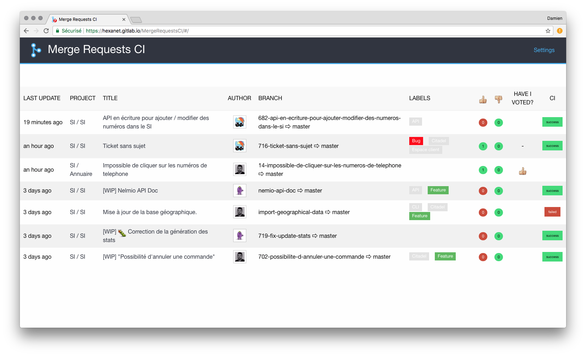

# MergeRequestsCI

UI to see all GitLab merge requests of your team in one place.



## Requirements

* [GitLab](https://about.gitlab.com/) >= 8.9

## Installation

### Clone the project

```shell
$ git clone https://github.com/Hexanet/MergeRequestsCI.git
$ cd MergeRequestsCI
```

### Install dependencies

```shell
$ npm install
```

## Run the server

After configuration, you have to build the code and launch the server.

```shell
$ npm run serve
```

Then open `http://localhost:3000` in your browser.

At the first connection, you must configure :

* **refreshInterval** : time in seconds between 2 dashboard updates
* **apiUrl** : url of your GitLab API
* **token** : private token for API calls

## Credits

Developed by the SI Team of [Hexanet](http://www.hexanet.fr/).

### Inspiration

Thanks [M6Web](https://github.com/M6Web) ([Github Team Reviewer](https://github.com/M6Web/GithubTeamReviewer)) and [Jean-François Lépine](http://blog.lepine.pro/) ([Taylorisme de la qualité logicielle](http://lanyrd.com/2015/forumphp/sdwzzb/)).

## License

[MergeRequestsCI](https://github.com/Hexanet/MergeRequestsCI) is licensed under the [MIT license](LICENSE).
